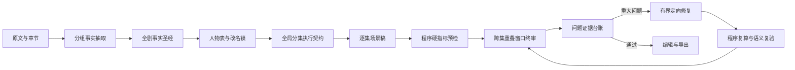

# 小说到微短剧：增强版数据流

## 为什么不沿用移动端的一次生成

移动端原型将输入截断到前 8000 字，只发起一次模型请求，并通过定时器模拟“分析、人物、重组、生成”四个步骤。这样无法保证长篇覆盖、人物改名一致性、分集连续性，也不能在失败后复用已完成的中间结果。

电脑端把每个阶段都变成显式数据资产：

## 关键设计

1. **切片按叙事边界而非固定字符数**
   优先沿用章节；长章再分段。每组分析只提取事实、事件、情绪节点与制片提示，减少“边总结边创作”造成的幻觉。

2. **故事圣经与人物改名分离**
   源名用于证据回溯，新名用于剧本生成。用户确认后锁定映射；程序按长名字优先替换，并在交付门检查任何旧名残留。

3. **先规划全部分集，再逐集生成**
   全局分集卡明确每集的冷开场、主要目标、中段反转和结尾卡点。写第 N 集时只传入故事圣经、本集原文证据、分集卡和上一集连续性，控制上下文与成本。

4. **结构化输出而非正则猜 JSON**
   在线管线使用 JSON Schema 约束章节分析、分集卡和场景稿。OpenAI 官方文档说明 Structured Outputs 能保证响应符合给定 Schema；本项目也保留兼容接口供其他模型网关使用。

5. **程序质检独立于模型自评**
   旧名残留、集场数量、双钩子、对白量、目标时长和高风险表达由确定性代码检查。模型可参与语义精修，但不能给自己的成稿“自证合格”。

6. **失败域和密钥边界清晰**
   原文与项目草稿保存在本地；API Key 使用操作系统安全存储，渲染进程无法直接读取。在线失败不会覆盖原文，离线模式可独立验收产品主链路。

7. **Huobao Drama 风格的职责分离**
   参考 Huobao Drama 的 Agent + Tool + 项目资产结构，以洁净室方式拆分角色命名、
   事实抽取、圣经架构、分集规划、逐集编剧和连续性编辑。每个 Agent 只能读取明确的
   上游资产并输出结构化结果，不能直接改写其他阶段数据。详细映射见
   [Huobao Drama 架构对齐记录](huobao-integration.md)。

8. **全剧连续性契约**
   故事圣经保存人物稳定 ID、原名/别名、世界规则、时间线、道具生命周期；分集卡新增
   唯一核心冲突、新增信息、入场/离场状态及转场原因。程序阻断人物串名、相邻集重复
   冲突、无因果跳场和道具不兑现。

9. **表演时长模拟而非总字数猜测**
   预计时长由对白语速、标点停顿、演员反应、动作节点和场间转场共同计算。60 秒规格
   默认 12–18 句、129–195 个对白汉字，并标记超过 18 字的长台词。

10. **可信成稿尾段与问题台账**
    成稿先经过程序硬指标，再按 4 集重叠窗口执行跨集审片。重大问题进入有证据的结构化
    台账，由创作模型定向修复；候选稿只有同时通过程序复算和独立语义复验才会替换原稿。
    修复后再次执行窗口审片，未收敛时明确阻断交付。详细设计见
    [可信成稿管线](trusted-quality-pipeline.md)。

## 系统级双模型调度

模型分工由 `src/pipeline/modelRouter.ts` 集中管理，调用阶段不能自行覆盖路由。界面只
展示“双模型协同已就绪”和统一进度，不向普通用户暴露阶段分配。

| 内部阶段 | 调度策略 |
|---|---|
| 角色名称整理、章节批量事实抽取 | 高速模型 |
| 故事圣经、全局分集与执行契约 | 创作模型 |
| 单集正式成稿 | 创作模型 |
| 成稿后的连续性、动机、攻守和钩子初审 | 高速模型 |
| 确定性门禁或语义初审不通过后的定向修复 | 创作模型 |
| 跨集重叠窗口终审与修复复验 | 高速模型 |
| 终审问题台账驱动的定向修复 | 创作模型 |

单集先经过程序时长门，再经过高速语义初审；任一不通过时，将两类问题合并为修复指令
交给创作模型。全剧完成后，还会按重叠窗口执行跨集终审并建立问题证据台账。修复稿必须
通过程序复算、语义复验与跨集复验，避免让高成本模型承担机械检查，也避免任何单一模型
直接给自己的结果“自证合格”。

## 一键拆书管线

一键拆书与短剧改编共享本地 `NovelDocument`，但保存为独立结果资产。Flash 模型完整
覆盖章节证据并在长篇时执行分层压缩；Pro 模型分别完成结构、人物、卖点/文风/仿写
分析；最终由程序组装六模块报告并核对章节证据，不再通过一次自由合成重新改写所有
专项结果。报告及最多 8 个修订版本随项目自动保存。

详细设计见 [一键拆书集成说明](book-analysis-integration.md)。

## 2026 创作约束

- 单集结构仍需快：3–5 秒建立处境或冲突，一集推进一个主要目标，中段升级，结尾形成未完成动作或信息差。
- “强情绪”不等于机械羞辱或无因果打脸。默认要求爽点带来人物选择和后果，让表达从情绪推进到情感。
- 题材不只停留在霸总、甜宠、复仇。预设支持类型融合、现实落点、轻喜反转与“微短剧+”方向。
- 上线前必须由人工完成版权、制片、备案/审查和平台规则判断。AI 辅助生成内容应按最新规定进行明显标识。

参考：

- [国家广播电视总局：《微短剧发展管理办法（征求意见稿）》（2026-06-24）](https://www.nrta.gov.cn/art/2026/6/24/art_113_73514.html)
- [国家广播电视总局：促进网络微短剧行业健康繁荣发展的通知](https://www.nrta.gov.cn/art/2025/2/5/art_113_70148.html)
- [国家广播电视总局：“微短剧+”行动计划](https://www.nrta.gov.cn/art/2025/1/4/art_113_69936.html)
- [中国网络视听节目服务协会：精品微短剧创新发展趋势研究报告](https://www.cnsa.cn/art/2025/10/20/art_1955_47709.html)
- [OpenAI：Structured model outputs](https://developers.openai.com/api/docs/guides/structured-outputs)
- [OpenAI：Text generation with the Responses API](https://developers.openai.com/api/docs/guides/text?api-mode=responses)

## 与移动端原型的差异

| 维度 | 移动端原型 | 桌面增强版 |
|---|---|---|
| 长文 | 截断前 8000 字 | 完整分章、分组处理 |
| 管线 | 单次提示词 | 多阶段结构化资产 |
| 改名 | 无 | 候选、可编辑、锁定、残留检查 |
| 连续性 | 无显式状态 | 故事圣经 + 上一集连续性 |
| 进度 | 定时器模拟 | 由真实阶段与完成量驱动 |
| 质量 | 无 | 程序硬指标 + 跨集终审 + 问题台账 + 修复复验 |
| 密钥 | 依赖外部网关 | 主进程安全存储，可配置协议 |
| 无网使用 | 示例兜底 | 完整离线验收主链路 |
