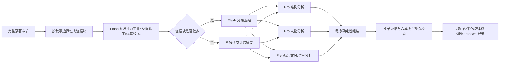

# 一键拆书集成说明

## 参考项目

参考项目 `app-chaishu` 的工作树源码多数为 0 字节，且 Git 索引和当前松散对象损坏；
本次从其最后一个可读取的完整提交 `56ab2e4` 直接读取真实源码，没有读取或复制
`.env`。

原项目的有效业务流为：

1. 按章节或约 3000 字分块。
2. Worker 模型并发抽取各块摘要。
3. Orchestrator 模型并行分析结构、人物、爽点。
4. 再调用一次 Orchestrator 合成六模块 Markdown 报告。
5. 报告支持版本微调和 Markdown 导出。

## 剧擎中的优化数据流

## 相比原项目的改进

- 不再按固定 3000 字粗切；优先保留章节，长章在段落或句末继续切分，正文不截断。
- 大型作品先做分层证据压缩，避免把所有块摘要一次塞给 Pro 模型。
- 三个专项结果由程序确定性组装，移除容易丢字段、改写证据的二次自由合成。
- 所有阶段由 `modelRouter.ts` 固定分工：高吞吐抽取与压缩使用 Flash，结构性判断和报告修订使用 Pro。
- 核心判断携带 `chapter-*` 证据 ID；程序会清理无效 ID，并检查六个报告模块的完整度。
- 模型未配置时仍可生成诚实标注的本地基础报告，不伪装成深度语义分析。
- 报告和最多 8 个修订版本随项目自动保存，可从项目档案恢复。
- 桌面端导出使用 `.md`，API Key 仍只存在 Electron 主进程的安全存储中。

## 用户界面

“一键拆书”是侧边栏第一个入口，位于“改编工坊”上方。用户只需导入小说并点击一次开始按钮；模型路由、并发、分层压缩和质量校验全部由系统管理。
